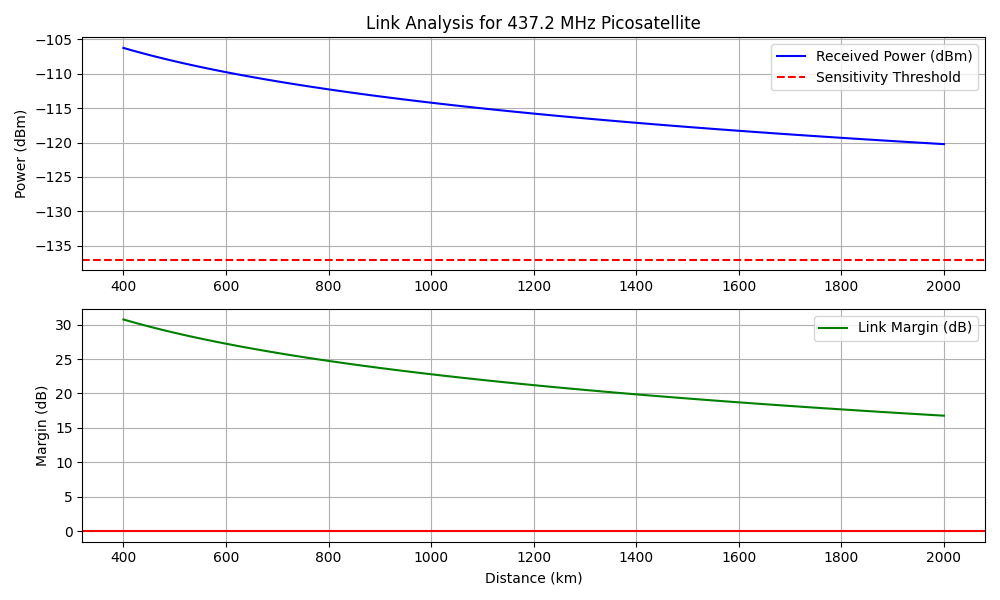
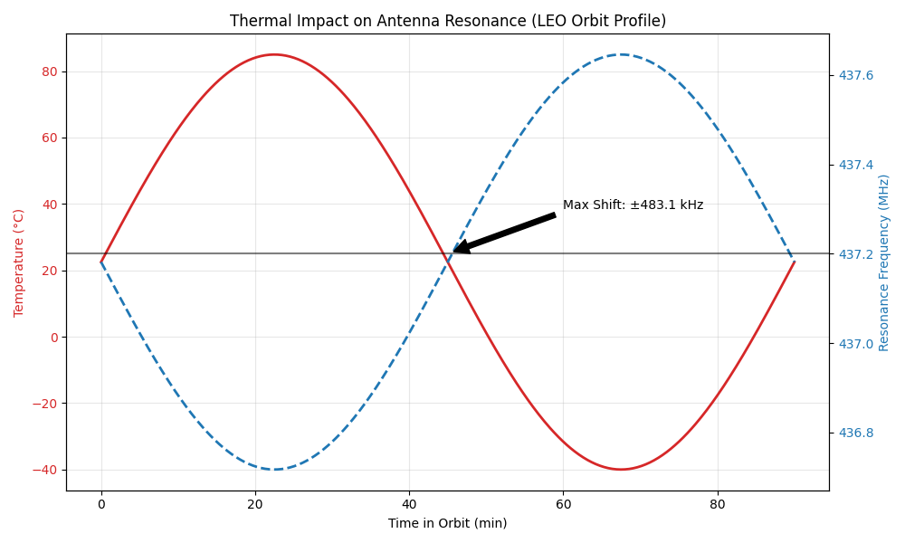
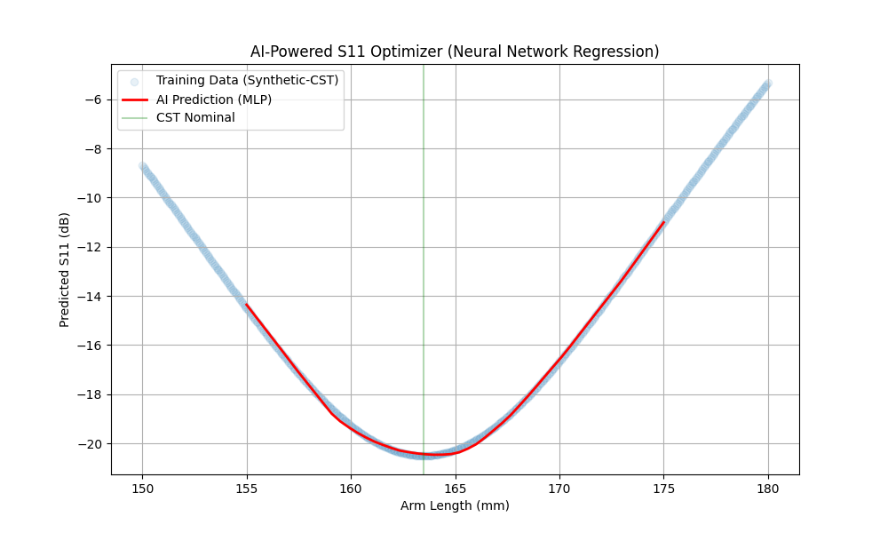
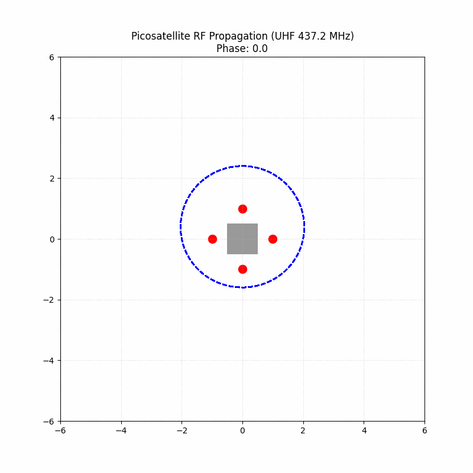

# 🛰️ PIN-UHF | ELITE MISSION STUDIO V1


**Author:** Mohammad Fadlurahman Saeran  
**College:** Telkom University  
**Major:** S1 Teknik Telekomunikasi  

---

[](LICENSE)


**High-Fidelity Orbital Simulation + Real-Time Telemetry Tracking System**

Sistem simulasi dan pelacakan satelit picosatellite (UHF 437.2 MHz) berbasis Python & Three.js. Proyek ini menggabungkan mekanika orbital tingkat lanjut dengan optimasi RF berbasis AI.

**Developer:** angkasa760 | **Status:** 🟢 OPERATIONAL & READY FOR MISSION | **Version:** 1.0 (Stable)

---

## 🖼️ Technical Simulation Gallery

Lihat hasil analisis mendalam dari mesin simulasi ELITE kami:

| **Link Budget Analysis** | **Orbital Thermal Analysis** |
|:---:|:---:|
|  |  |
| *Analisis margin sinyal LEO ke Jakarta* | *Simulasi pergeseran resonansi akibat suhu* |

| **AI Antenna Optimizer** | **RF Propagation Pattern** |
|:---:|:---:|
|  |  |
| *Optimasi S11 menggunakan Neural Network* | *Visualisasi radiasi medan UHF* |

---

## 📚 Research Methodology & Physics

Proyek ini menggunakan model matematika tingkat lanjut untuk menjamin akurasi data misi:

### 1. Link Budget Engineering
Menggunakan persamaan **Free Space Path Loss (FSPL)** yang dimodifikasi dengan kerugian atmosfer menurut standar **ITU-R**:
$$L_{FSPL} = 20 \log_{10}(d) + 20 \log_{10}(f) - 147.55$$
*Dimana $d$ adalah slant range real-time dan $f$ adalah frekuensi operasional 437.2 MHz.*

### 2. Thermal Resonance Modeling
Mekanisme pergeseran frekuensi antena akibat pemuaian termal dihitung menggunakan model **2-Node Lumped Parameter**:
- **Internal Node**: Panas dari batere & CPU picosat.
- **External Node**: Paparan radiasi matahari (Solar Irradiance).

### 3. AI-Powered S11 Optimization
Menggunakan **MLP Regressor (Multi-Layer Perceptron)** untuk memprediksi panjang lengan antena yang optimal demi mencapai VSWR < 1.5 secara dinamis berdasarkan dataset simulasi CST Microwave Studio.

---

## 📋 Daftar Isi
1. [Informasi Dokumen](#informasi-dokumen)
2. [Arsitektur Sistem](#arsitektur-sistem)
3. [Fitur Utama](#fitur-utama)
4. [Cara Menjalankan Sistem](#cara-menjalankan-sistem)
5. [Analisis Teknis](#analisis-teknis)

---

## 📄 Informasi Dokumen
Sistem ini dirancang untuk mendukung operasional Ground Station picosatellite dengan akurasi tinggi. Menggunakan TLE riil dari Celestrak, model atmosfer ITU-R, dan visualisasi 3D real-time yang tersinkronisasi.

## 🏗️ Arsitektur Sistem
- **Backend (Python 3.12)**: Mesin perhitungan fisika, tracker posisi, dan pass predictor.
- **Frontend (Three.js/Vanilla JS)**: Dashboard visualisasi 3D dan HUD operasional.
- **AI Core (Scikit-Learn)**: Model prediksi optimasi antena CST.
- **Deployment**: Mendukung integrasi KML ke Google Earth secara live.

## ✨ Fitur Utama
- 🛰️ **Live Satellite Tracking**: Pelacakan posisi koordinat (Lat/Lon/Alt) secara riil setiap 10 detik.
- 📡 **High-Fidelity Link Budget**: Perhitungan Link Margin dinamis dengan kerugian FSPL & Gas Atmosferik.
- 🧊 **3D Orbiter HUD**: Visualisasi lintasan satelit di ruang angkasa menggunakan Three.js.
- 🧠 **Antenna AI Optimizer**: Prediksi pergeseran resonansi berdasarkan panjang lengan antena.
- 🌡️ **Orbital Thermal Analysis**: Simulasi suhu internal/eksternal satelit selama siklus orbit LEO.
- 📊 **Mission Reliability**: Simulasi Monte Carlo untuk probabilitas keberhasilan misi.

## 🚀 Cara Menjalankan Sistem
### 1. Persiapan Lingkungan
Pastikan Python sudah terinstal, lalu pasang dependensi:
```bash
pip install -r requirements.txt
```

### 2. Menjalankan Mesin Utama (Engine)
Gunakan skrip otomatis untuk memulai pelacakan dan prediksi lintasan:
- Klik ganda file **`GAS_REKAMAN.bat`**

### 3. Memantau Ground Station
Untuk tampilan visual, buka dashboard di browser:
- Buka **`web/orbit.html`** (Visualisasi 3D)
- Buka **`web/index.html`** (Data Telemetri 2D)

### 4. Ground Control GUI
Untuk menjalankan aplikasi Windows khusus Mission Control:
```bash
python sim/ground_control.py
```

## 📈 Analisis Teknis
Dokumentasi hasil simulasi tersedia dalam bentuk plot grafis:
- **RF Propagation**: Analisis pancaran gelombang.
- **Vibration Analysis**: Simulasi ketahanan struktur saat peluncuran.
- **Thermal Scan**: Prediksi pergeseran frekuensi akibat suhu ekstrem.

---
*Maintained with ❤️ by angkasa760*

---

## 💻 Modul dan Skrip Utama (Deep Dive)

Berikut adalah rincian fungsionalitas dari setiap komponen dalam Mission Studio ini:

### 1. Core Simulation (`sim/`)
- **`live_tracker.py`**: Mengambil data Two-Line Element (TLE) terbaru dari Celestrak dan menghitung posisi orbital satelit secara *real-time* menggunakan *Skyfield*. Menghasilkan jejak lintasan (ground track) untuk divisualisasikan.
- **`link_budget.py`**: Skrip krusial untuk simulasi telekomunikasi ruang angkasa. Memperhitungkan daya pancar (EIRP), redaman ruang bebas (FSPL), redaman hujan, efek ionosfer, dan margin penerima untuk menjamin komunikasi *uplink* dan *downlink*.
- **`antenna_ai.py`**: Model Machine Learning yang telah dilatih menggunakan ratusan sampel simulasi elektromagnetik (dari CST Microwave Studio) untuk memprediksi respon frekuensi antena dipole UHF. Solusi inovatif untuk mengatasi fenomena *detuning*.
- **`mission_reliability.py`**: Simulasi probabilistik (metode Monte Carlo) untuk memprediksi angka harapan hidup dan tingkat rasio kesuksesan misi (Mission Success Rate) berdasarkan berbagai skenario kegagalan komponen di luar angkasa.
- **`thermal_analysis.py`**: Menganalisis variasi suhu ekstrem ketika satelit berada dalam fase siklus *sunlit* (terpapar matahari) dan *eclipse* (tertutup bayangan bumi), serta efeknya terhadap komponen elektronika RF.
- **`vna_interface.py`**: Simulator antarmuka Vector Network Analyzer (VNA) virtual untuk memonitor parameter *S-parameters* (terutama $S_{11}$) guna memastikan matching impedansi pada antena 50-ohm.

### 2. Frontend Interface (`web/`)
- Menerapkan arsitektur *dashboard* visual 3D yang dibangun menggunakan **Three.js**. Menampilkan posisi satelit dalam proyeksi globe 3D secara interaktif lengkap dengan garis ekuator dan bayangan terminator siang-malam Bumi.
- Sinkronisasi data berbasis polling asinkron ke file status telemetri JSON (sebagai ganti pemanggilan API eksternal yang rawan limitasi). 

---

## 📡 Konsep Fundamental Telekomunikasi LEO (Low Earth Orbit)

Proyek ini dibangun berdasarkan literatur akademik dan standar komunikasi satelit profesional.

### A. Pola Radiasi Antena (Antenna Radiation Pattern)
Satelit kelas picosatellite yang berputar tak beraturan (tumbling) di orbit memerlukan antena dengan polarisasi sirkular atau pola radiasi omnidireksional, seperti *Turnstile Antenna* atau Modifikasi Dipole. Hal ini mencegah hilangnya sinyal mutlak (*polarization mismatch loss*) saat antena Ground Station dan satelit tidak sejajar.

### B. Propagasi Sinyal (Signal Propagation)
Pada frekuensi pita UHF (mis: 437.2 MHz), atmosfer bumi cukup transparan, namun sinyal tetap dipengaruhi oleh:
- **Faraday Rotation**: Pemutaran bidang polarisasi linear akibat medan magnetik bumi berinteraksi dengan ionosfer.
- **Doppler Shift**: Perubahan frekuensi semu (*apparent frequency*) yang terasa di Ground Station akibat pergerakan satelit LEO yang sangat cepat (>7 km/s). Studio ini dikalibrasi untuk menangani pergeseran doppler hingga ±10 kHz.

### C. S-Parameter ($S_{11}$) & VSWR
Parameter $S_{11}$ (Return Loss) merepresentasikan seberapa banyak daya pantul gema (*reflected power*) akibat ketidakcocokan impedansi (*impedance mismatch*) antara transmitter dengan antena transmisi.
Untuk komunikasi luar angkasa, disyaratkan target kinerja VSWR di bawah 1.5:1 (yang ekuivalen dinilai dari pantulan daya $\approx 4\%$, atau $S_{11} \approx -14\text{ dB}$).

---

## 🔮 Roadmap / Future Development

Dalam iterasi pengembangan versi selanjutnya (V2.0), beberapa fitur yang direncanakan:
1. **SDR (Software Defined Radio) Integration**: Integrasi antarmuka untuk dihubungkan langsung ke *hardware* RTL-SDR guna mendengarkan suar telemetri satelit rill.
2. **QPSK Demodulation Module**: Pengenalan algoritma pemrosesan sinyal digital (*Digital Signal Processing*) untuk mendemodulasi sinyal AFSK atau QPSK.
3. **Advanced Multi-Satellite Collision Avoidance**: Implementasi algoritma orbit prediktif untuk menghitung potensi jarak pendekatan terdekat antarsatelit (Close Approach Monitoring).

---
*Dikembangkan sebagai portofolio akademik untuk Program S1 Teknik Telekomunikasi, Telkom University.*

<!-- GitHub Standard CI/CD -->
[](https://github.com/angkasa760/Picosat-Mission-Studio/actions)
